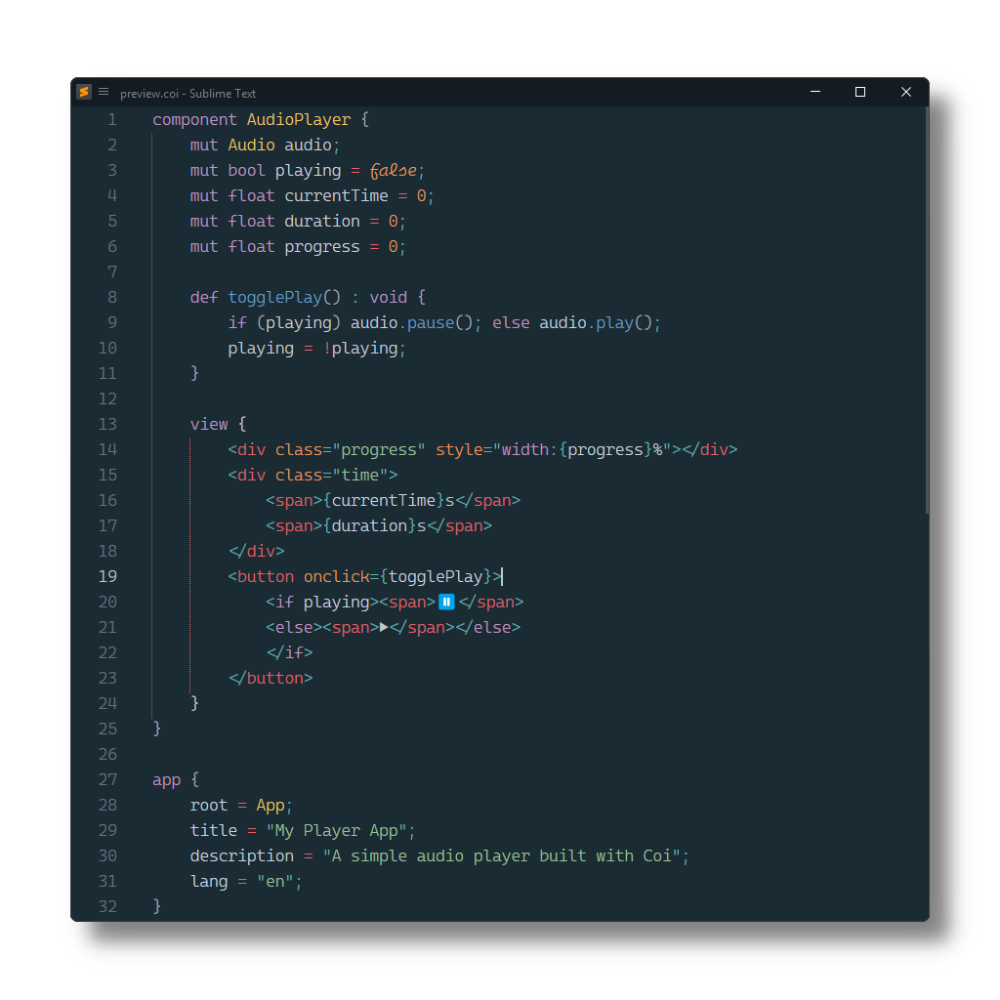

# Coi

[Coi](https://io-eric.github.io/coi) syntax definitions for [Sublime Text](https://www.sublimetext.com) based on its HTML and CSS syntax.

## Installation

### Package Control

The easiest way to install is using [Package Control](https://packagecontrol.io). It's listed as `Coi`.

1. Open `Command Palette` using <kbd>ctrl+shift+P</kbd> or menu item `Tools → Command Palette...`
2. Choose `Package Control: Install Package`
3. Find `Coi` and hit <kbd>Enter</kbd>

### Manual Install

1. Download appropriate [Coi.sublime-package](https://github.com/SublimeText/Coi/releases) for your Sublime Text build.
2. Copy it into _Installed Packages_ directory

> [!NOTE]
>
> To find _Installed Packages_...
>
> 1. call _Menu > Preferences > Browse Packages.._
> 2. Navigate to parent folder

## Troubleshooting

### §1 Syntax Definition Parse Errors

Coi extends Sublime Text's HTML syntax definition.

If Coi syntax highlighting doesn't work 
and console displays syntax errors in _Coi.sublime-syntax_,
please make sure to remove any out-dated syntax override.

Steps:

1. call _Menu > Preferences > Browse Packages.._
2. Look for _HTML_ folder
3. Remove it or at least delete any syntax definition in it.

### §2 Styles are not correctly highlighted

Coi relies on CSS (`source.css`) 
to scope style blocks and inline style tag attributes.

Make sure to remove related out-dated syntax packages,
which don't meet least compatibility requirements.

They can be identified by calling 
e.g. `sublime.find_syntax_by_scope("source.css")` in ST's console.
